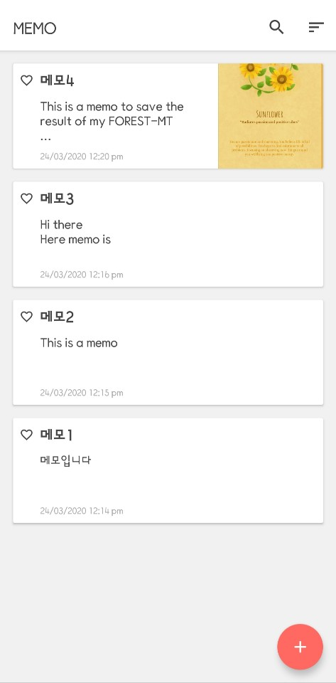
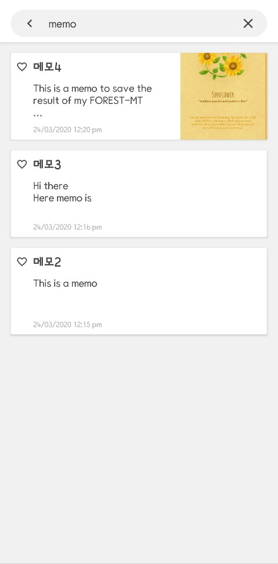
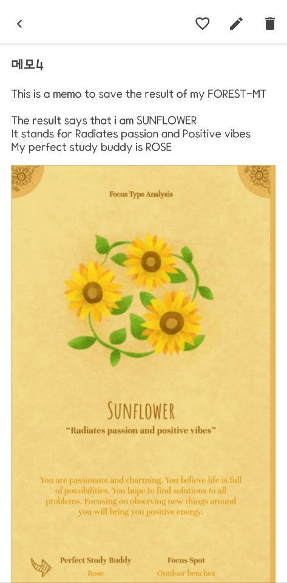
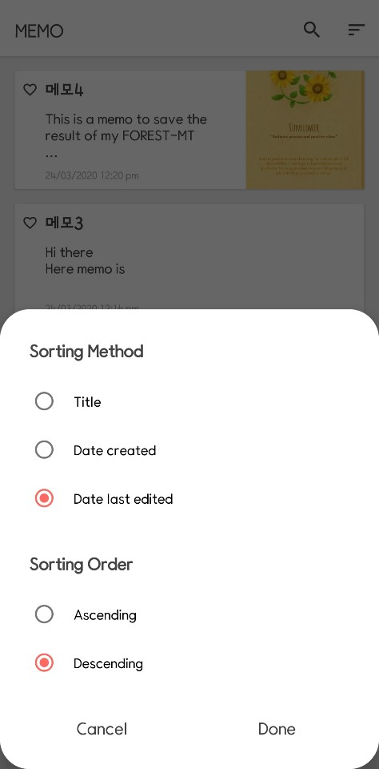

# MemoApp

Created: 2020-02-17

Last Updated: 2020-02-24

## Screenshot

   

## Description

You can create memos to save text and image.

## Skills

* Realm
* ViewModel
* Anko (deprecated)
* Glide
* [PhotoView](https://github.com/chrisbanes/PhotoView)
* [ImagePicker](https://github.com/ParkSangGwon/TedImagePicker)
* Material Design
